# Mentor-Mentee Portal System

Welcome to the Mentor-Mentee Portal System! This web application aims to enhance communication between mentors and mentees through a centralized user-friendly platform.

## Description

The Mentor Mentee Program helps class coordinators to keep track of academic performance of each student in the class. The Mentor Mentee Program is regulated in every semester in every Branch.

The Mentor Mentee Portal System is a web application that enhances communication between mentors and mentees through a centralized user-friendly platform. The portal will allow mentors of the respective sections to focus and manage progress of every student, while mentees can easily contact their respective mentors.

It utilizes Java as the back-end programming language, Spring MVC framework for efficient application development, MySQL as the backend database, and frontend technologies including HTML, CSS, JavaScript, and Bootstrap for an enhanced user experience.

## Screenshots

Below are some screenshots of the Mentor-Mentee Portal System:

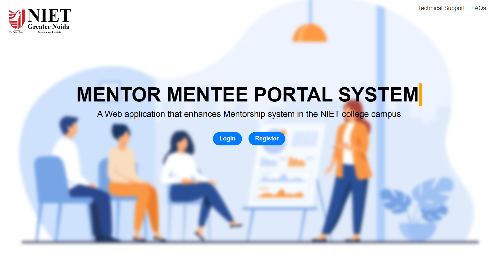 | 
------------ | -------------
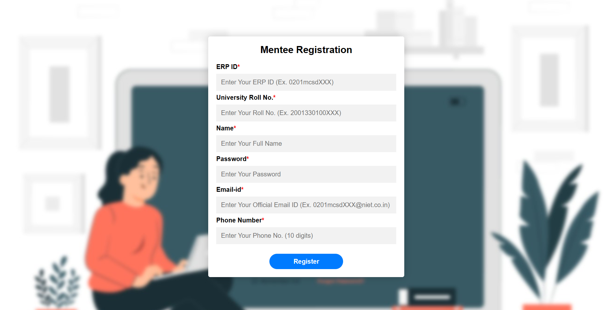 | 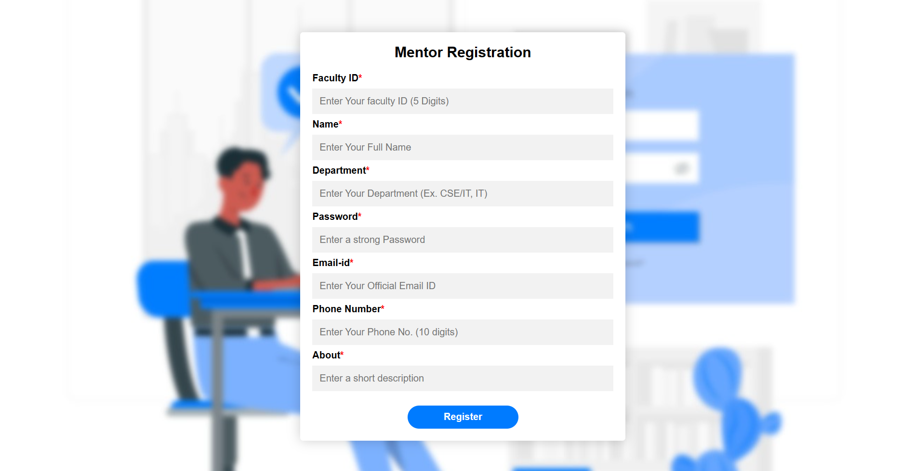
 | 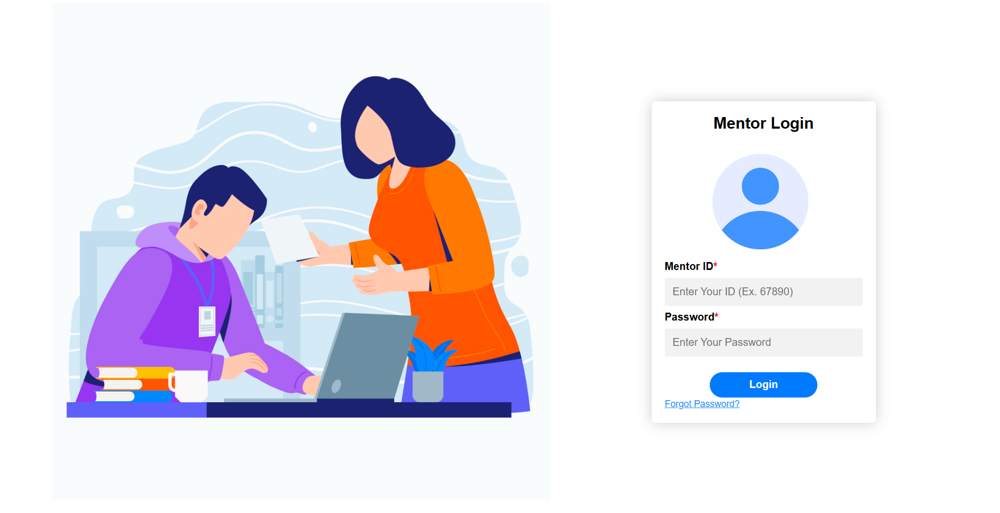
 | 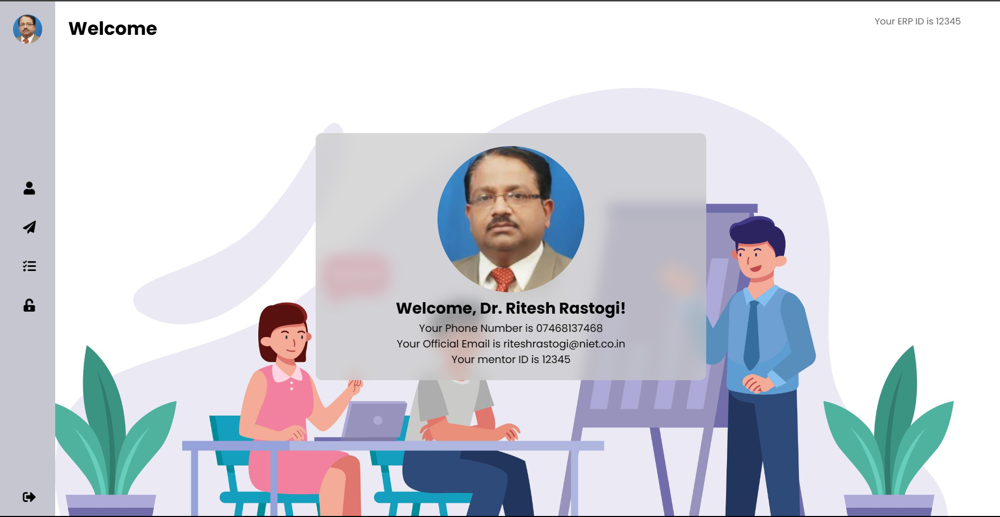
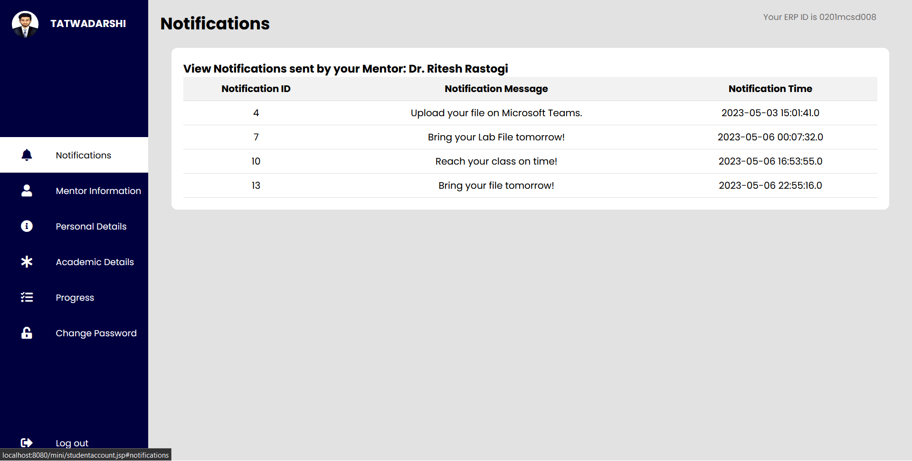 | 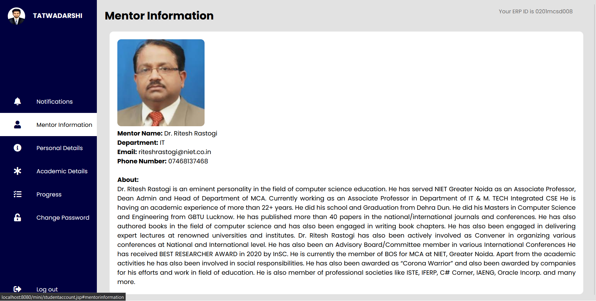
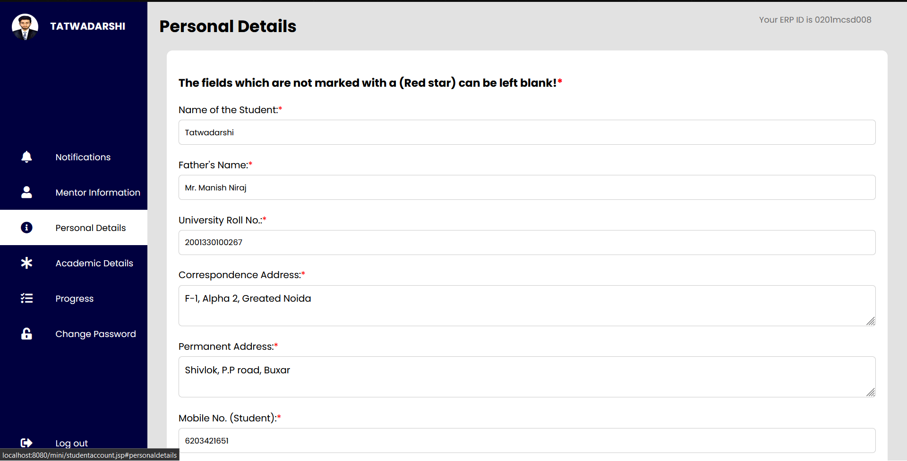 | 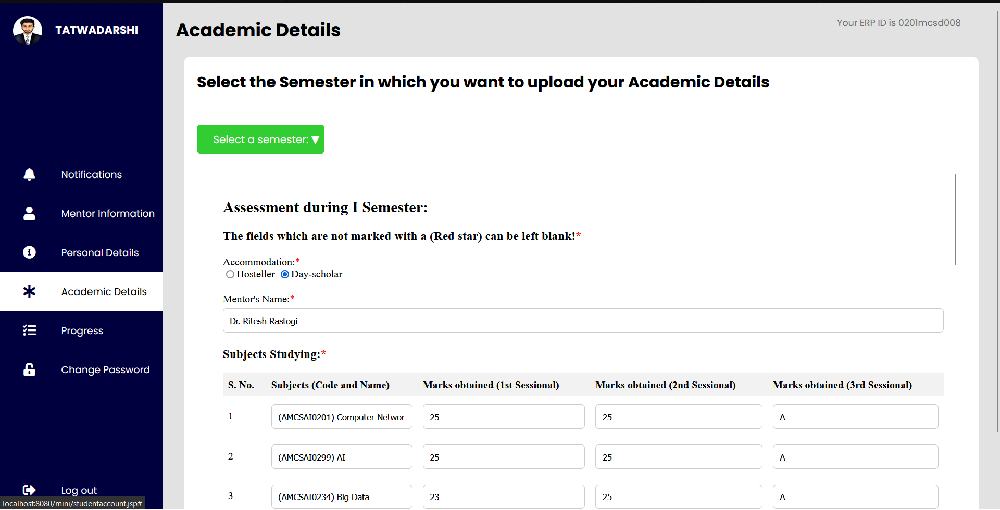
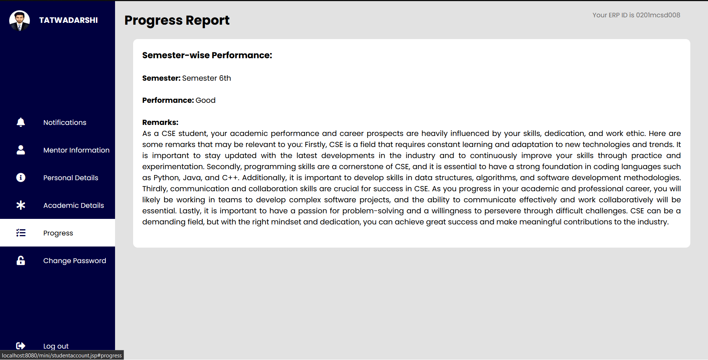 | 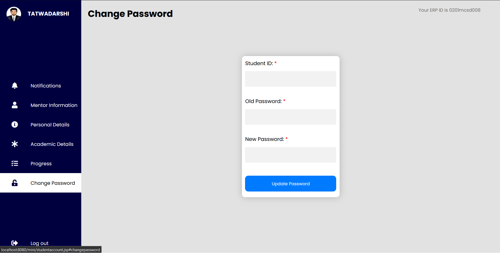
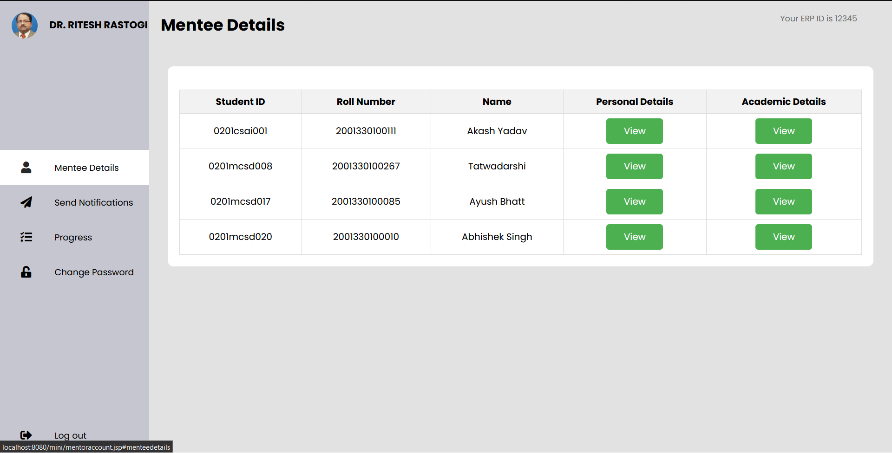 | 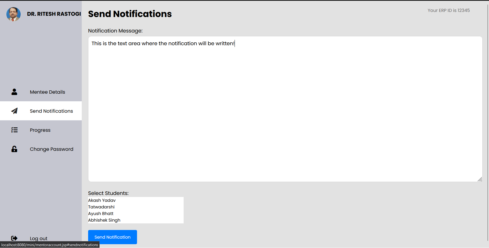
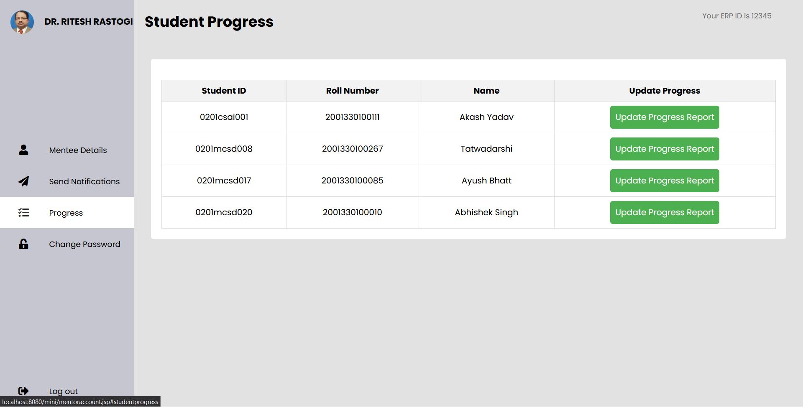 |

## Features

- Centralized platform for mentor-mentee communication.
- User-friendly interface.
- Robust backend system for data management.
- Integration of frontend technologies for enhanced usability.

## How to Use

1. Clone the repository.
2. Configure the backend database settings.(mini/Database.sql)
3. Run the application locally from Eclipse IDE.
4. Access the application through the provided URL by running the Tomcat Server.

## Contributors

- [Tatwadarshi](https://github.com/Dev7091)

## License

This project is licensed under the [MIT License](LICENSE).

